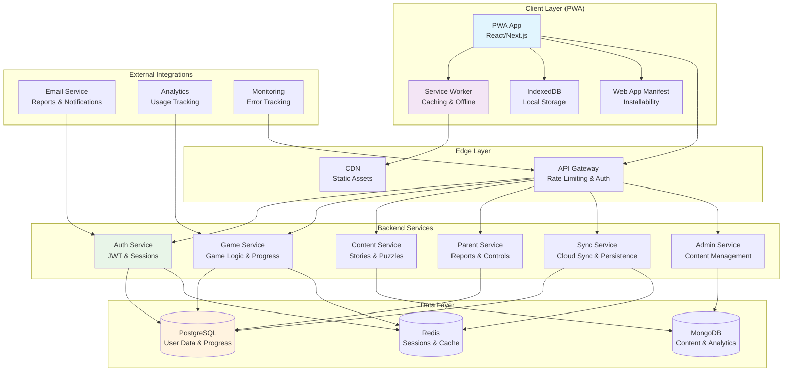

# System Architecture Document - little-thinkers

**Author:** Senior Technical Architect
**Date:** May 11, 2026

## Overview

This document outlines the comprehensive system architecture for Little Thinkers, a Progressive Web App (PWA) designed to deliver engaging cognitive skill-building games and educational content for children aged 7-15. The architecture prioritizes scalability, offline-first functionality, and robust security to support network-resilient gameplay, COPPA-compliant data handling, and cross-platform accessibility.

The system is built as a modern PWA with a service-oriented backend, enabling seamless offline experiences while maintaining real-time sync capabilities. Key architectural principles include:

- **Offline-First**: Core gameplay functions without network connectivity
- **Scalable Microservices**: Modular backend services for independent scaling
- **Security-First**: End-to-end encryption and COPPA compliance
- **Performance-Optimized**: Sub-2-second load times and responsive interactions

## System Architecture Diagram



**Data Flow Description:**
1. **User Interaction**: Child interacts with PWA app, which checks Service Worker cache first
2. **Offline Handling**: Service Worker serves cached content; IndexedDB stores local progress
3. **API Requests**: Authenticated requests route through API Gateway to backend services
4. **Data Persistence**: User data stored in PostgreSQL; content in MongoDB; sessions cached in Redis
5. **Sync Process**: Sync Service handles background reconciliation of local and cloud data
6. **External Services**: Email for reports, analytics for engagement tracking, monitoring for reliability

## Tech Stack Recommendations

### Frontend (PWA Client)
- **Framework**: Next.js 14+ with React 18+ (App Router for optimal performance)
- **Styling**: Tailwind CSS with custom design system for accessibility
- **State Management**: Zustand for lightweight, scalable state (avoids Redux complexity)
- **PWA Libraries**: Workbox for Service Worker management, Web App Manifest for installability
- **Accessibility**: React Aria components for WCAG 2.1 AA compliance

### Backend Services
- **Runtime**: Node.js 20+ with TypeScript for type safety
- **Framework**: Fastify for high-performance APIs (faster than Express)
- **Microservices**: Docker containers with Kubernetes orchestration for scalability
- **API**: RESTful with GraphQL for complex parent dashboard queries

### Data Layer
- **Primary Database**: PostgreSQL 15+ for relational user data (progress, badges, assessments)
- **Content Database**: MongoDB for flexible content storage (stories, puzzles, metadata)
- **Cache**: Redis for session management and frequently accessed data
- **Search**: Elasticsearch for content discovery and analytics

### Infrastructure & DevOps
- **Hosting**: Vercel/Netlify for PWA deployment with global CDN
- **Containerization**: Docker for consistent environments
- **Orchestration**: Kubernetes for production scaling
- **CI/CD**: GitHub Actions with automated testing and Lighthouse audits

### Security & Monitoring
- **Authentication**: JWT with refresh tokens, OAuth 2.0 for social login
- **Encryption**: TLS 1.3, AES-256 for data at rest
- **Monitoring**: Sentry for error tracking, DataDog for performance monitoring
- **Testing**: Playwright for E2E, Jest for unit tests, Lighthouse CI for PWA metrics

## PWA Features

### Service Workers Strategy
Service Workers enable offline-first functionality with intelligent caching:

```javascript
// Service Worker Registration
if ('serviceWorker' in navigator) {
  navigator.serviceWorker.register('/sw.js')
    .then(registration => console.log('SW registered'))
    .catch(error => console.log('SW registration failed'));
}

// Service Worker Implementation (sw.js)
const CACHE_NAME = 'little-thinkers-v1';
const STATIC_CACHE = 'static-v1';
const DYNAMIC_CACHE = 'dynamic-v1';

self.addEventListener('install', event => {
  event.waitUntil(
    caches.open(STATIC_CACHE).then(cache => {
      return cache.addAll([
        '/',
        '/manifest.json',
        '/static/css/main.css',
        '/static/js/main.js',
        '/offline.html'
      ]);
    })
  );
});

self.addEventListener('fetch', event => {
  // Stale-While-Revalidate for API calls
  if (event.request.url.includes('/api/')) {
    event.respondWith(
      caches.open(DYNAMIC_CACHE).then(cache => {
        return cache.match(event.request).then(response => {
          const fetchPromise = fetch(event.request).then(networkResponse => {
            cache.put(event.request, networkResponse.clone());
            return networkResponse;
          });
          return response || fetchPromise;
        });
      })
    );
  } else {
    // Cache-first for static assets
    event.respondWith(
      caches.match(event.request).then(response => {
        return response || fetch(event.request);
      })
    );
  }
});
```

### Manifest.json Configuration
```json
{
  "name": "Little Thinkers",
  "short_name": "Thinkers",
  "description": "Cognitive skill-building games for kids",
  "start_url": "/",
  "display": "standalone",
  "background_color": "#ffffff",
  "theme_color": "#4f46e5",
  "orientation": "portrait-primary",
  "scope": "/",
  "icons": [
    {
      "src": "/icon-192.png",
      "sizes": "192x192",
      "type": "image/png"
    },
    {
      "src": "/icon-512.png",
      "sizes": "512x512",
      "type": "image/png"
    }
  ],
  "categories": ["education", "games"],
  "screenshots": [
    {
      "src": "/screenshot-mobile.png",
      "sizes": "390x844",
      "type": "image/png",
      "form_factor": "narrow"
    }
  ]
}
```

### Caching Strategy (Stale-While-Revalidate)
- **Static Assets**: Cache-first strategy for CSS, JS, images (versioned URLs)
- **API Responses**: Stale-while-revalidate for game progress, content metadata
- **User Data**: Network-first with background sync for critical updates
- **Offline Fallback**: Custom offline page with cached game states

### Offline-First Capabilities
- **Local Storage**: IndexedDB for game progress, user preferences, cached content
- **Background Sync**: Queue API requests when offline, sync on reconnection
- **Conflict Resolution**: Last-write-wins for progress, user confirmation for conflicts
- **Progressive Enhancement**: Core gameplay works offline, advanced features require network

## Data Models & Database Schema

### PostgreSQL Schema (User Data & Progress)

```sql
-- Users and Authentication
CREATE TABLE users (
  id UUID PRIMARY KEY DEFAULT gen_random_uuid(),
  email VARCHAR(255) UNIQUE NOT NULL,
  password_hash VARCHAR(255),
  role VARCHAR(50) NOT NULL CHECK (role IN ('parent', 'child', 'admin')),
  created_at TIMESTAMP DEFAULT NOW(),
  updated_at TIMESTAMP DEFAULT NOW(),
  last_login TIMESTAMP,
  is_active BOOLEAN DEFAULT TRUE
);

-- Child Profiles
CREATE TABLE child_profiles (
  id UUID PRIMARY KEY DEFAULT gen_random_uuid(),
  parent_id UUID REFERENCES users(id),
  name VARCHAR(100) NOT NULL,
  age INTEGER CHECK (age >= 7 AND age <= 15),
  avatar_url VARCHAR(500),
  accessibility_settings JSONB,
  gameplay_mode VARCHAR(50) DEFAULT 'smart' CHECK (gameplay_mode IN ('smart', 'chill', 'challenge')),
  created_at TIMESTAMP DEFAULT NOW(),
  updated_at TIMESTAMP DEFAULT NOW()
);

-- Game Progress
CREATE TABLE game_progress (
  id UUID PRIMARY KEY DEFAULT gen_random_uuid(),
  child_id UUID REFERENCES child_profiles(id),
  game_type VARCHAR(50) NOT NULL,
  difficulty VARCHAR(50) DEFAULT 'easy',
  level INTEGER DEFAULT 1,
  score INTEGER DEFAULT 0,
  completed_at TIMESTAMP,
  time_spent INTERVAL,
  hints_used INTEGER DEFAULT 0,
  created_at TIMESTAMP DEFAULT NOW(),
  updated_at TIMESTAMP DEFAULT NOW()
);

-- Rewards and Achievements
CREATE TABLE badges (
  id UUID PRIMARY KEY DEFAULT gen_random_uuid(),
  child_id UUID REFERENCES child_profiles(id),
  badge_type VARCHAR(100) NOT NULL,
  badge_name VARCHAR(255) NOT NULL,
  description TEXT,
  earned_at TIMESTAMP DEFAULT NOW(),
  is_shared BOOLEAN DEFAULT FALSE
);

CREATE TABLE thought_sparks (
  id UUID PRIMARY KEY DEFAULT gen_random_uuid(),
  child_id UUID REFERENCES child_profiles(id),
  amount INTEGER NOT NULL,
  source VARCHAR(255),
  earned_at TIMESTAMP DEFAULT NOW()
);

-- Streaks and Mascot
CREATE TABLE thinking_streaks (
  id UUID PRIMARY KEY DEFAULT gen_random_uuid(),
  child_id UUID REFERENCES child_profiles(id),
  current_streak INTEGER DEFAULT 0,
  longest_streak INTEGER DEFAULT 0,
  last_activity DATE,
  paused_until DATE,
  created_at TIMESTAMP DEFAULT NOW()
);

CREATE TABLE mascot_progress (
  id UUID PRIMARY KEY DEFAULT gen_random_uuid(),
  child_id UUID REFERENCES child_profiles(id),
  level INTEGER DEFAULT 1,
  experience INTEGER DEFAULT 0,
  accessories JSONB,
  updated_at TIMESTAMP DEFAULT NOW()
);

-- Assessments
CREATE TABLE skill_assessments (
  id UUID PRIMARY KEY DEFAULT gen_random_uuid(),
  child_id UUID REFERENCES child_profiles(id),
  assessment_type VARCHAR(50),
  domain VARCHAR(100),
  score_before INTEGER,
  score_after INTEGER,
  assessed_at TIMESTAMP DEFAULT NOW()
);

-- Sync Metadata
CREATE TABLE sync_metadata (
  id UUID PRIMARY KEY DEFAULT gen_random_uuid(),
  child_id UUID REFERENCES child_profiles(id),
  last_sync TIMESTAMP DEFAULT NOW(),
  sync_version BIGINT DEFAULT 0,
  device_id VARCHAR(255)
);
```

### MongoDB Collections (Content & Analytics)

```javascript
// Content Collections
db.stories.insertMany([
  {
    _id: ObjectId(),
    title: "The Kind Octopus",
    content: "...",
    age_range: { min: 7, max: 12 },
    cognitive_skills: ["empathy", "biology"],
    theme: "ocean",
    reading_level: "grade_3",
    created_at: new Date(),
    updated_at: new Date(),
    approved: true,
    published_at: new Date()
  }
]);

db.puzzles.insertMany([
  {
    _id: ObjectId(),
    type: "word_pop",
    difficulty: "medium",
    words: ["think", "brain", "logic"],
    hints: ["Starts with T", "Related to mind"],
    solution: "think",
    created_at: new Date()
  }
]);

db.science_topics.insertMany([
  {
    _id: ObjectId(),
    question: "Why do matches catch fire?",
    answer: "...",
    age_range: { min: 8, max: 15 },
    cognitive_skills: ["curiosity", "chemistry"],
    created_at: new Date()
  }
]);

// Analytics Collections
db.user_analytics.insertMany([
  {
    user_id: ObjectId(),
    session_id: ObjectId(),
    event_type: "game_completed",
    game_type: "word_pop",
    duration: 300, // seconds
    score: 100,
    timestamp: new Date(),
    device_info: {
      platform: "mobile",
      browser: "chrome"
    }
  }
]);
```

## API Design

### RESTful Endpoints

#### Authentication
```
POST   /api/auth/login              # User login
POST   /api/auth/refresh            # Refresh JWT token
POST   /api/auth/logout             # Logout user
POST   /api/auth/register           # Parent registration
POST   /api/auth/forgot-password    # Password reset request
POST   /api/auth/reset-password     # Password reset confirmation
```

#### Child Profiles
```
GET    /api/children                # List parent's children
POST   /api/children                # Create child profile
GET    /api/children/:id            # Get child profile
PUT    /api/children/:id            # Update child profile
DELETE /api/children/:id            # Delete child profile (COPPA)
```

#### Games & Progress
```
GET    /api/games                   # List available games
GET    /api/games/:type             # Get game details
POST   /api/games/:type/start       # Start game session
POST   /api/games/:type/submit      # Submit game answer
GET    /api/progress/:childId       # Get child progress
POST   /api/progress/sync           # Sync offline progress
```

#### Content
```
GET    /api/content/stories         # List stories
GET    /api/content/stories/:id     # Get story details
GET    /api/content/puzzles         # List puzzles
GET    /api/content/puzzles/daily   # Get puzzle of the day
GET    /api/content/science         # List science topics
GET    /api/content/science/:id     # Get science topic
```

#### Rewards & Reports
```
GET    /api/rewards/:childId/badges # Get earned badges
GET    /api/rewards/:childId/sparks # Get thought sparks
GET    /api/reports/:childId/weekly # Get weekly report
GET    /api/reports/:childId/full   # Get full dashboard
POST   /api/reports/:childId/print  # Generate printable certificate
```

#### Admin (Protected)
```
POST   /api/admin/content           # Create content
PUT    /api/admin/content/:id       # Update content
DELETE /api/admin/content/:id       # Delete content
GET    /api/admin/analytics         # Get analytics
POST   /api/admin/ab-test           # Create A/B test
```

### GraphQL Schema (For Complex Queries)

```graphql
type Query {
  childDashboard(childId: ID!): ChildDashboard
  parentReports(parentId: ID!): [Report]
  contentLibrary(filters: ContentFilters): [ContentItem]
}

type Mutation {
  submitGameProgress(input: GameProgressInput!): GameResult
  updateChildSettings(input: ChildSettingsInput!): ChildProfile
  createContent(input: ContentInput!): ContentItem
}

type ChildDashboard {
  child: ChildProfile
  recentGames: [GameSession]
  badges: [Badge]
  currentStreak: Int
  mascot: MascotProgress
  worldMap: WorldMapProgress
}
```

## Security & Authentication

### JWT Token Management
- **Access Tokens**: Short-lived (15 minutes) for API authentication
- **Refresh Tokens**: Long-lived (7 days) stored in HttpOnly cookies
- **Token Rotation**: New refresh token issued on each use
- **Blacklisting**: Compromised tokens can be invalidated server-side

### Session Security
```javascript
// JWT Payload Structure
{
  userId: "uuid",
  role: "parent|child|admin",
  childId: "uuid", // for child sessions
  iat: 1640995200,
  exp: 1640996100,
  iss: "little-thinkers-api"
}
```

### Protected Routes
- **Parent Routes**: Require parent authentication
- **Child Routes**: Require child authentication, scoped to child's data
- **Admin Routes**: Require admin role
- **Rate Limiting**: 100 requests/minute per user, 1000/hour per IP

### Data Encryption
- **In Transit**: TLS 1.3 with perfect forward secrecy
- **At Rest**: AES-256 encryption for sensitive user data
- **Key Management**: AWS KMS or equivalent for encryption keys
- **COPPA Compliance**: Data minimization, parental consent logging

### Security Headers
```
Content-Security-Policy: default-src 'self'; script-src 'self' 'unsafe-inline'
X-Frame-Options: DENY
X-Content-Type-Options: nosniff
Strict-Transport-Security: max-age=31536000; includeSubDomains
Referrer-Policy: strict-origin-when-cross-origin
Permissions-Policy: geolocation=(), microphone=(), camera=()
```

## Deployment & Monitoring

### CI/CD Pipeline
```yaml
# .github/workflows/deploy.yml
name: Deploy PWA
on:
  push:
    branches: [main]
jobs:
  test:
    runs-on: ubuntu-latest
    steps:
      - uses: actions/checkout@v3
      - name: Setup Node.js
        uses: actions/setup-node@v3
        with:
          node-version: '20'
      - name: Install dependencies
        run: npm ci
      - name: Run tests
        run: npm test
      - name: Lighthouse CI
        uses: treosh/lighthouse-ci-action@v10
        with:
          urls: http://localhost:3000
          configPath: .lighthouserc.json
  deploy:
    needs: test
    runs-on: ubuntu-latest
    steps:
      - name: Deploy to Vercel
        uses: amondnet/vercel-action@v25
        with:
          vercel-token: ${{ secrets.VERCEL_TOKEN }}
          vercel-org-id: ${{ secrets.VERCEL_ORG_ID }}
          vercel-project-id: ${{ secrets.VERCEL_PROJECT_ID }}
```

### Monitoring & Alerting
- **Performance**: Lighthouse scores tracked daily, alerts on <85 mobile/<90 desktop
- **Uptime**: 99.5% SLA with PagerDuty alerts for downtime
- **Errors**: Sentry for client/server errors with user impact analysis
- **Security**: Automated vulnerability scanning, intrusion detection
- **Business Metrics**: User engagement, sync success rates, content performance

### Scalability Considerations
- **Horizontal Scaling**: Kubernetes pods auto-scale based on CPU/memory
- **Database Sharding**: User data partitioned by region for global distribution
- **CDN**: Static assets served via global CDN for low-latency delivery
- **Caching**: Redis clusters for session and content caching
- **Load Balancing**: API Gateway distributes traffic across service instances

This architecture ensures Little Thinkers delivers a robust, scalable, and secure PWA experience that prioritizes child safety, educational effectiveness, and technical excellence.